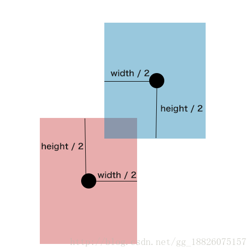

# 2D 矩形碰撞检测


## 算法需要的信息

* 两个矩形的中心坐标(x,y)
* 两个矩形的长(width)
* 两个矩形的高(height)



## 判断代码

两点之间各轴距离，小于两个矩形长高和的一半。

````
Math.abs(red.x - blue.x) < red.width/2 + blue.width/2 //横向判断
&&
Math.abs(red.y - blue.y) < red.height/2 + blue.height/2 //纵向判断
````

满足就出现了碰撞。

具体代码看： [演示代码](01.html)