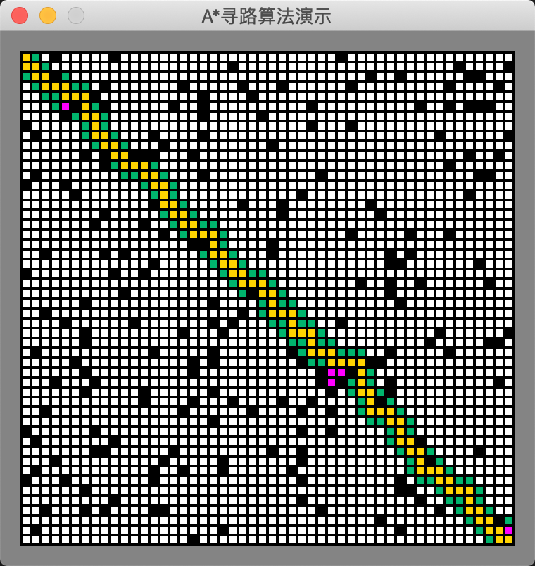
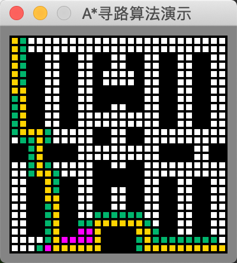

# golang实现的实时A*寻路算法演示

执行效果

* 白色 可通行的道路
* 黑色 不可通行的障碍物
* 绿色 open列表的节点
* 红色 close列表的节点
* 金色 最终选取的路径

为了实现这个演示，需要有线程安全的map，显示和运算都要读取map数据。

sync.map是1.9版本带的线程安全map，相关资料可以看：
* [Go1.9 安全map用法](https://blog.csdn.net/ChamPly/article/details/77622328)
* [go sync.Map使用和介绍](https://blog.csdn.net/u010230794/article/details/82143179)

## 支持不同地图的测试
下图是坦克大战第一局的地图，从左上角到右下脚的寻路过程。

