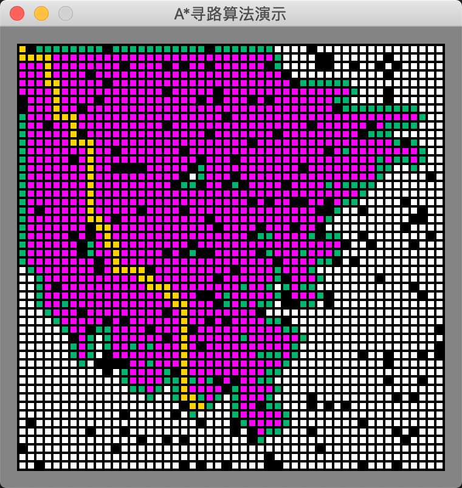
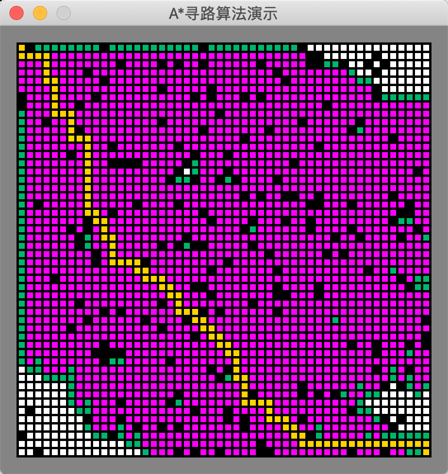
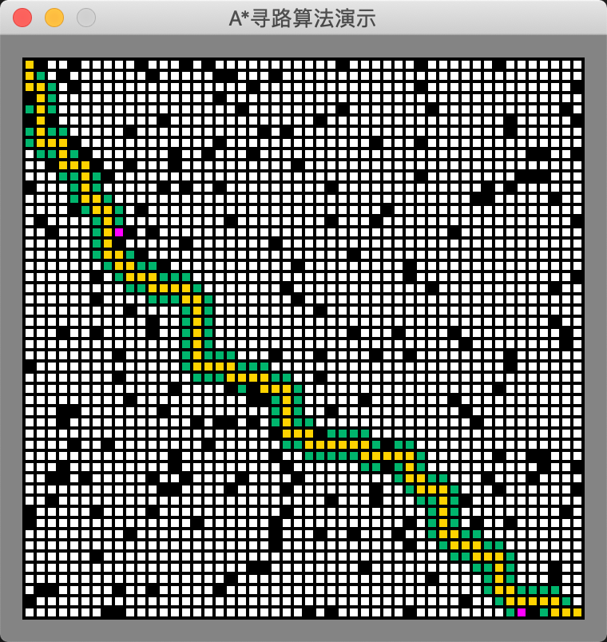
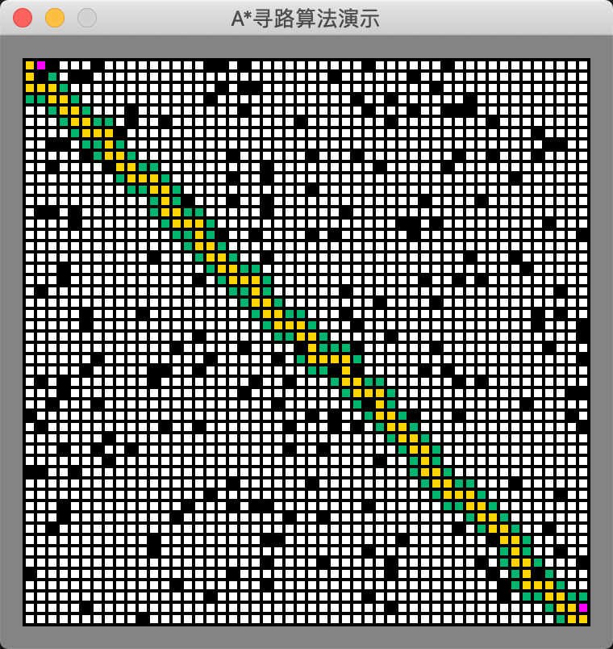

# A*算法不同启发算法对寻路影响

$ f(n) = g(n) + h(n)$
启发函数h(n)会影响A*算法的行为:

* 在极端情况下，当启发函数$h(n)$始终为0，则将由$g(n)$决定节点的优先级，此时算法就退化成了Dijkstra算法。
* 如果$h(n)$始终小于等于节点n到终点的代价，则A*算法保证一定能够找到最短路径。但是当$h(n)$的值越小，算法将遍历越多的节点，也就导致算法越慢。
* 如果$h(n)$完全等于节点n到终点的代价，则A*算法将找到最佳路径，并且速度很快。可惜的是，并非所有场景下都能做到这一点。因为在没有达到终点之前，我们很难确切算出距离终点还有多远。
* 如果$h(n)$的值比节点n到终点的代价要大，则A*算法不能保证找到最短路径，不过此时会很快。
* 在另外一个极端情况下，如果$h(n)$相较于$g(n)$大很多，则此时只有$h(n)$产生效果，这也就变成了最佳优先搜索。

## 曼哈顿距离

### H(n) =  (abs ( n.x – goal.x ) + abs ( n.y – goal.y ) )


````golang
func (m *AStarMap) getHScore(n, target Point) int {
	x := AbsInt(n.Col - target.Col)
	y := AbsInt(n.Row - target.Row)
	return x + y
}
````

寻路情况





几乎把所有的点都过了一遍。
启发函数 小于或等于实际代价

### H(n) = D * (abs ( n.x – goal.x ) + abs ( n.y – goal.y ) )

````golang
func (m *AStarMap) getHScore(n, target Point) int {
	x := AbsInt(n.Col - target.Col)
	y := AbsInt(n.Row - target.Row)
	return 2 * (x + y)
}
```` 

寻路效果



启发函数 略大于 实际代价

## 欧几里得距离
欧几里得距离是指两个节点之间的直线距离，
因此其计算方法也是我们比较熟悉的：$\sqrt{(p2.x-p1.x)^2 + (p2.y-p1.y)^2}$。
其函数表示如下：

````python
function heuristic(node) =
    dx = abs(node.x - goal.x)
    dy = abs(node.y - goal.y)
    return D * sqrt(dx * dx + dy * dy)
````

### 平方后的欧几里得距离

通过使用距离的平方而避免欧几里得距离中昂贵的平方根运算

```` golang
func (m *AStarMap) getHScore(n, target Point) int {
	x := AbsInt(n.Col - target.Col)
	y := AbsInt(n.Row - target.Row)
	return x*x + y*y
}
````

执行效果



基本是两点之间的直线。

## 参考资料

* [路径规划之 A* 算法](https://developer.aliyun.com/article/685477)
* [AStar 算法 1](https://www.jianshu.com/p/a353e2c40824)
