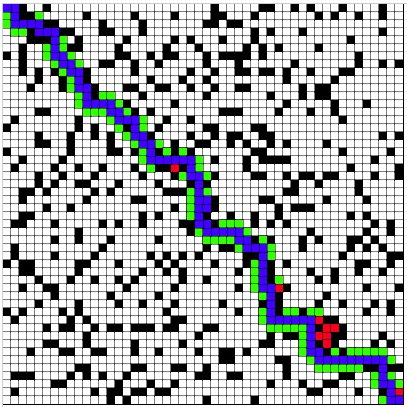

# JavaScript 实现的A*算法演示

js实现的A*寻路演示源码来自:[pengliheng](https://github.com/pengliheng/leetcode/blob/master/algorithm/A-Star/)
复制过来的演示代码:[A* JS演示代码](./index.html)

执行效果


其中

* 白色，可通行的路
* 黑色，障碍物
* 蓝色节点是最终选择的路径,用路径回溯弄出来的
* 红色是 close 列表的点
* 绿色是 open 列表的点

这个演示的H值计算

````javascript
    heuristic(a, b) {
      var di = b.i - a.i
      var dj = b.j - a.j
      return di * di + dj * dj
    }
```` 