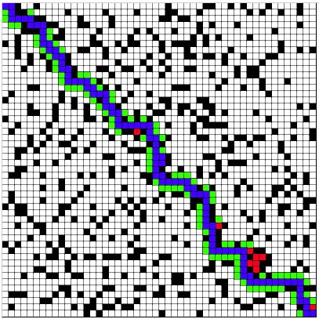

A*（A-Star)算法是一种静态路网中求解最短路径最有效的直接搜索方法。
[百度百科A*算法](https://baike.baidu.com/item/A%2A%E7%AE%97%E6%B3%95)

相关的关键点：

**需要两个列表**

* 一个记录下所有被考虑来寻找最短路径的方块（称为open 列表）
* 一个记录下不会再被考虑的方块（成为closed列表）

初始时，首先在closed列表中添加当前位置（我们把这个开始点称为点 “A”）。
然后，把所有与它当前位置相邻的可通行小方块添加到open列表中。


**我们将会给每个方块一个F=G+H 和值：**

* G是从开始点A到当前方块的移动量。所以从开始点A到相邻小方块的移动量为1，该值会随着离开始点越来越远而增大。  G值是从起点到该点，是一段已经走过的路程，代价是准确可知的
* H是从当前方块到目标点（我们把它称为点B）的移动量估算值。这个常被称为探视，因为我们不确定移动量是多少 – 仅仅是一个估算值。
* F = G + H, 走到终点消耗的代价值 ，要知道F值，需要计算G和H的值 。


**G值移动量** 

* 如果你允许对角线移动，你可以针对对角线移动把移动量调得大一点。
* 如果你有不同的地形，你可以将相应的移动量调整得大一点 – 例如针对一块沼泽，水，或者猫女海报:-)


**H值是从当前方块到终点的移动量估算值**

* 移动量估算值离真实值越接近，最终的路径会更加精确。如果估算值停止作用，很可能生成出来的路径不会是最短的（但是它可能是接近的）。


**重复以下步骤来找到最短路径：** 

```
将起点加入close表
while(结束条件){
	获取close表的最后一个节点S
	获取S点周围所有符合加入条件的点（下文所说的三点），	加入open列表
	计算open列表F值最低的格子T
	T从open表中删除加入close表
}


```
再次循环的时候，是不是第一步获取的节点S就是最后加入的T了，如此就可以跟随着这个T，一步步的扩展路径了

**结束条件**：

* 如果有这条路径存在，则是当结束点所在的节点被加入到close后，寻路就结束了。
* 或者不存在这条路径，那么就是open列表中不再有节点的时候。

open列表实际上是一步步往外扩展的格子，当这个列表没有节点的时候并且终点还没有在close列表中，

那么说明所有能扩展到的格子已经都被走过了，仍然没有走到终点，此时便是没有这条路了


**加入open列表的时候，要保证的3点**

* 这个点不能在close表中
* 这个点不能在open表中
* 这个点是合法的，什么叫合法？这里简单的就是可以通行的，不能是障碍物


这里有js实现的A*寻路演示
<https://github.com/pengliheng/leetcode/blob/master/algorithm/A-Star/>



其中

*  绿色、红色、蓝色都是探索过的点，
* 蓝色节点是最终选择的路径
*  绿色是放弃的点，红色是死路点。

算法中的

* h值： 其中当前邻居节点的h值就是当前邻居节点到终点的直线距离。
*  每个节点都记录一下前一个节点（neighbor.prev = this.current;）按照前一个节点倒退的路径就是这里的蓝色路径。
*  图中的红色点，是 closed列表 中的点， 由于上一项的路径赋值在后面，路径中的closed点也会赋值成蓝色。
*  open列表中的点是绿的， 是还可以继续探索的。

这个代码的执行也可以看  [A*演示](index.html)

参看：
[A*寻路算法](https://www.jianshu.com/p/65282bd32391)


