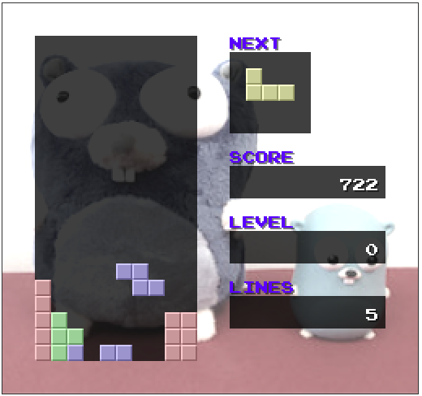
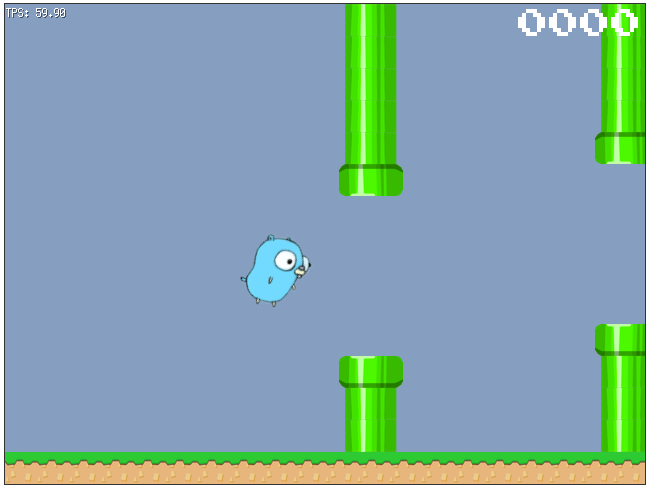
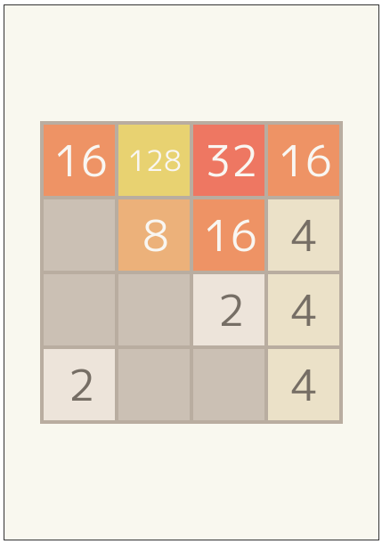
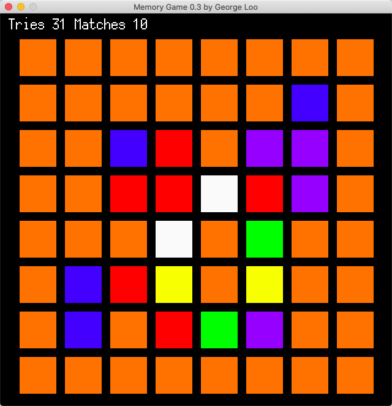

#基于ebiten开发的游戏收集

基于 github.com/hajimehoshi/ebiten 开发的游戏收集。

## 自带游戏例子：俄罗斯方块
演示： <https://ebiten.org/examples/blocks.html>

代码： <https://github.com/hajimehoshi/ebiten/tree/master/examples/blocks>

## 自带游戏例子：flappy
演示：<https://ebiten.org/examples/flappy.html>

代码：<https://github.com/hajimehoshi/ebiten/tree/master/examples/flappy>

## 自带游戏例子：2048
演示： <https://ebiten.org/examples/2048.html>

代码：
<https://github.com/hajimehoshi/ebiten/tree/master/examples/2048>

## golang-ebiten-memoryGame

代码： <https://github.com/GeorgeLoo/golang-ebiten-memoryGame>
