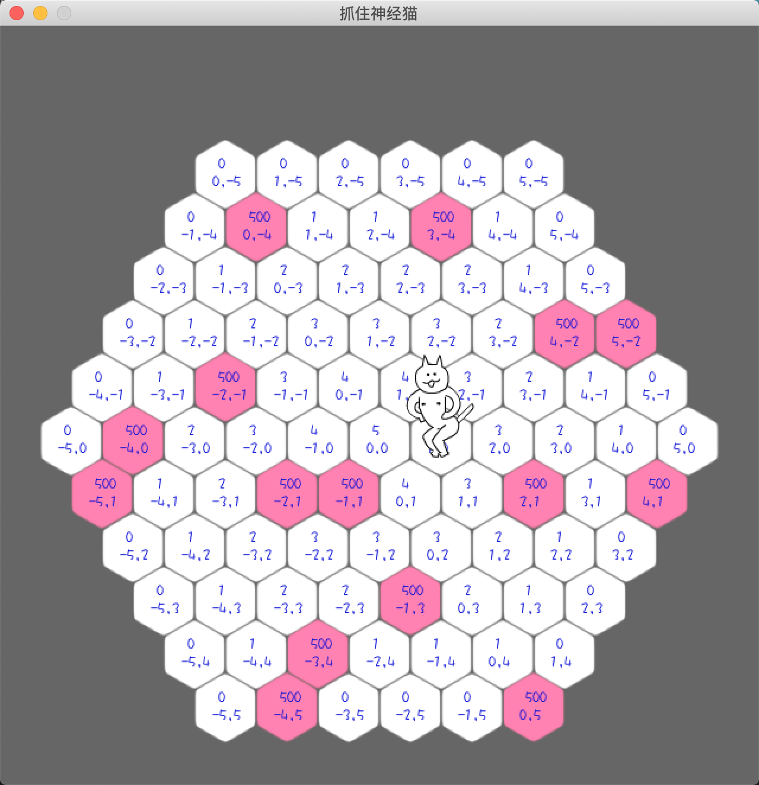
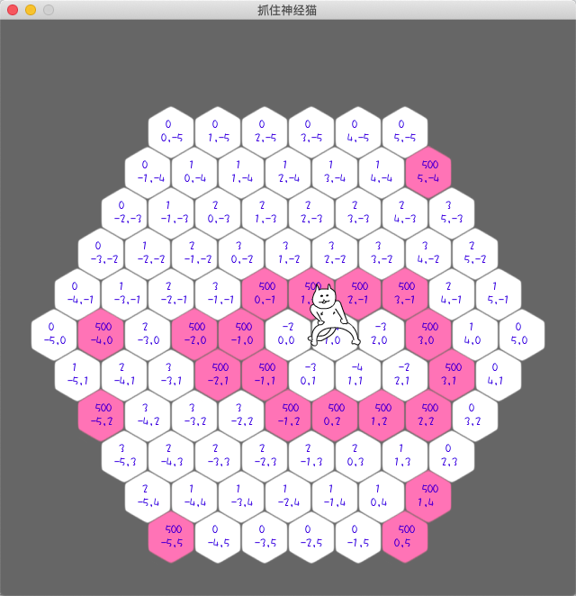

**地图的数据结构**

这个游戏采用的六角系统的轴坐标系（也叫梯形坐标系）来存储位置。

有关六角坐标的相关内容请看下面三篇文章：

* [六角网格大观](https://indienova.com/indie-game-development/hex-grids-reference/)
* [网格沉思-游戏中的网格系统](https://indienova.com/indie-game-development/game-programming-grids/)
* [六角网格的实现](https://indienova.com/indie-game-development/grid-implementation-of-hex/)

**猫选路的算法**

* 没被堵住时,最小路径法
* 被围住时,最大通路法(选择某个路径后，可选择的路最多。)

**最小路径法**

* 障碍物的权重是500，其他权重是该位置走出地图的步数。猫只要选择权重小的，就是最小路径。
* 每格的上面是计算出来的权重。猫优先往最小值的权重方向移动。
* 每格的下面地图位置的坐标，使用的是轴坐标系

**最大通路法**

下图是围住时的权重及位置图，可以看到围住部分的权重都是负数，这些位置的权重绝对值是该点目前可走的通路数。

