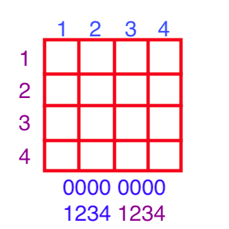

## 地图
**地图区块说明**

|  区块   | 说明  |
|  :----  | ----  |
|   | 砖墙 (Brick)：很容易摧毁 |
|   | 石墙 (Stone)：只能4级坦克才能摧毁 |
|   | 树林 (Grass)：阻碍视线 |
|   | 沙漠 (Sand)：使坦克更难控制 |
|   | 水域 (Water)：没船无法通行 |

## 砖墙、石墙布局说明

每个 56 * 56 的砖墙贴图在最终使用时，会分成 4 * 4 的块来处理。

贴图时是用二进制来表示的。

* 前4位， 从左到右每列是否有墙。 
* 后4位，从上到下每行是否有墙。

当炮弹威力是2时，每次摧毁2行或2列 坦克当前宽度的墙。

## 坦克寻路算法思路

**简单选路思路：**

生成新的坦克

* 随机选择一条直线路（需要距离大于一定长的路），距离基地近的路优先。
* 沿着这条直线路走到头，再重复上一步随机选一条路线。

当敌方坦克出现在基地附近时，将增加难度。选路时靠近基地的优先就会增大难度。