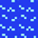

## 地图元素编码

|  区块   | 说明  |  数字  |
|  :----  | ----  |----  |
|  | 道路 | 0, |
|   | 砖墙 (Brick) | 完整砖 241 <br />半块砖(193,161,129,81,65,33,17) <br /> 被完全摧毁的砖墙(1) |
|   | 树林 (Grass) | 2 |
|   | 水域 (Water) | 3 |
|   | 沙漠 (Sand) | 4 |
|   | 石墙 (Stone) | 5 |
|  | 同方坦克 |13 ，4～7位是指向 |
|   | 敌人坦克 |14  4～7位是指向 |
|   | 炮弹 |15  4～7位是指向 |

### 地图和屏幕坐标系的使用场景

类比：我们要去西安玩，分别去兵马俑、大明宫...  这个是粗略的抽象地图。
具体游玩时，要如何走，这就需要精准的地图。

|     | 地图  |  屏幕坐标系  |
|  :----  | ----  |----  |
| 使用场景 | 坦克行动策略决策 | 碰撞判断、堵车判断、屏幕绘图 |


### 半块砖的逻辑

当炮弹威力是2时，每次摧毁全块砖。


### 地图中坦克和炮弹走向


### 关键算法
[golang的位运算](https://www.cnblogs.com/ghj1976/p/12323705.html)
```
vType & 0x0f // 只提取类型部分

if (vType & 0xf0 != 0xf0){}  //  判断是否有半块砖或方向属性
```

## 碰撞

* 碰撞判断是基于屏幕坐标体系来做判断的，不是游戏地图。


## 坦克寻路算法思路


**简单选路思路：**

* 随机选择一个方向和随机步数。
* 然后按照这个数字和方向走，
* 当出现路口时，或不能走时，再重复随机选一个新的方向和步数。

* 随机选择一条直线路（需要距离大于一定长的路），距离基地近的路优先。
* 沿着这条直线路走到头，再重复上一步随机选一条路线。


当敌方坦克出现在基地附近时，将增加难度。选路时靠近基地的优先就会增大难度。