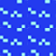
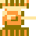
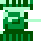
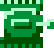

# tank90 游戏说明

游戏规则：
* 每一关有20辆敌军坦克（不同关卡，不同类型不同级别坦克不一样）。
* 如果基地老鹰被射中，或者在一个关卡中玩家的坦克生命为零， 则Game Over。

## 游戏难度级别

* 普通级别 所有敌人的速度 + 0.1 ， 
* 难度级别 所有敌人的速度 + 0.2 ，同时更聪明。

## 地图

### 地图区块

|  区块   | 说明  | 逻辑  |
|  :----  | ----  | ----  |
|   | 砖墙 (Brick) | 很容易摧毁 | 
|   | 石墙 (Stone) | 初始子弹无法打破,只能4级坦克才能摧毁。|
|   | 树林 (Grass) | 阻碍视线 |
|   | 沙漠 (Sand) | 使坦克更难控制,表现为：在沙漠时，**反应迟钝**，刹车时（刹车距离变长）；左右转、掉头时，会继续滑行一段距离才会响应。反应延迟时间跟通过沙漠时的速度有关。|
|   | 水域 (Water) | 没船坦克无法通行，子弹可以打过去的河流。 |

## 玩家

|  级别   | 玩家一  | 玩家二 | 炮弹 | 速度 | 是否能击毁石墙 |
|  :---- | ----  | ----  | ----  |----  |----  |
|  Level 1   |   |  | 1 | 3.2/8.8 | 否 |
|  Level 2   |   |  | 1 | 3.8/12.8 | 否 |
|  Level 3   |   |  | 2 | 4.2/12.8 | 否 |
|  Level 4   |   |  | 2 | 3.4/11.2 | 是 |

速度分别是 坦克速度/炮弹速度
* 速度基准：速度为1，标示一秒走一个坦克身位。 速度3.2就是一秒走3.2个坦克长度。

升级条件：获得升级宝箱（五角星和手枪）

##AI坦克

AI坦克有五种类型，如下：

* 默认坦克
* 炮弹速度更快的加强型坦克，
* 移动速度快的偷袭车，
* 大家伙装甲坦克。
* 正常不会出现，只有特殊关卡或者AI坦克获得特殊宝箱时升级到。

|  类型   | HP1 灰色 | HP2   绿色 | HP3   橙色 | HP4   红色 | 类型参数 | 说明 | 
|  :---- | ----  | ----  | ----  | ----  | ----  | ----  | 
|  类型 1 普通型  |   |  |  |  | 分数:100 炮弹:1 速度: 2.6/8.0 是否能击毁石墙:否 |  否 |
|  类型 2  快速偷袭车 四轮装甲车（外形像老鼠） |   |  |  |  | 分数:200 炮弹:1 速度: 4.6/10.0 是否能击毁石墙:否 |速度是所有坦克中最快的，灵活度很高，不容易击中。 |
|  类型 3  炮弹加强 连发坦克 |   |  |  |  | 分数:300 炮弹:2 速度: 3.2/11.2 是否能击毁石墙:否 | 相比普通坦克它的炮管要短，速度中等，会连发子弹，不过出现的次数不多。 | 
|  类型 4 7轮履带重装坦克  |   |  |  |  | 分数:400 炮弹:1 速度: 3.6/11.6 是否能击毁石墙:否  | 移动速度慢，一般出现都是高HP的，拥有非常强大的防御力 ｜
|  类型 5 特殊重型坦克  |   |  |  |  | 分数:500 炮弹:1 速度: 3.0/9.6 是否能击毁石墙:是 |  只有特殊场景和AI坦克获得特定宝箱时升级才会出现。 |

* 其中的速度是默认速度，在经过不同地形，不同难度下，会有相应变化。
* 炮弹的数字2是炮弹威力翻倍，炮弹发射间隔速度减少

AI坦克的级别就是生命值（HP）不同，HP值依次是1～4（即几发炮弹可以摧毁这辆坦克）.

## 炮弹

* 为了增加紧张感，允许炮弹互相抵消。
* 允许攻击玩家，不过攻击后，不会击毁坦克，而是让玩家不能动15秒。
* 炮弹离开地图边缘，会出现击中动画，内存销毁视野外的炮弹。
* 炮弹有最小发射间隔时间要求（间隔3秒），不能瞬间发射出去很多炮弹。
* 炮弹的2是指一次可以发生两枚炮弹，当然这两枚也有时间间隔。

## 宝箱

| 宝箱  | 我方获得  | 敌方获得 | 备注 | 
| :---- | ----  | ----  | ----  |
|   | 玩家坦克升级到level 4 | 敌方升级到 type 5 |  | 
|   | 增加 1 life，最多9 | 敌方升级到 level 4 |  | 
|   | 摧毁当前所有敌人 | 摧毁所有玩家当前坦克 |  | 
|   | 15秒无敌 | 所有敌人升级到 level 4 |  | 
|   | 升一级 | 敌人升一级 | 坦克升级道具 | 
|   | 能够通过水域 | 能够通过水域 | 500分以上才出现 | 
|   | 强化基地：基地无敌30秒，最多获得2个 | 基地的保护墙被拆除 | 500分以上才出现 | 
|   | 所有敌人不能动 | 我方坦克不能动 | 500分以上才出现 | 

参考
* [《坦克大战》：比街机版本内容还丰富，关于一份被埋在心底的思念](https://www.163.com/dy/article/FGHO9OFR0526DOOQ.html)
* [经典游戏《坦克大战》让队友和敌兵绝望的自建场景，劳资就没指望能过关](https://zhuanlan.zhihu.com/p/111243310)
* [童年玩的《坦克大战》，隐藏着一部爱的告白书](https://zhuanlan.zhihu.com/p/24707671)