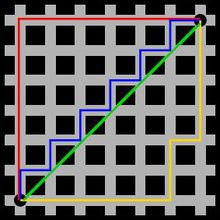

# AI坦克能力说明

对于AI坦克，需要考虑下面几类相遇场景：

* 碰到玩家坦克场景
* 碰到其它AI坦克场景
* 地图各种静态元素相遇场景

## 发现危险(遇到玩家坦克)
这时候有视野的概念，发现玩家坦克时，需要评估是先逃离，还是攻击。

*正在被攻击的危险*

*炮弹相碰*
为了增加游戏的可玩性，炮弹具有相碰互相销毁的能力。炮弹互相相碰不会出爆炸效果。

## 碰到其它AI坦克

碰到其他AI坦克有下面两种情况：（三辆或更多辆坦克相遇，也可以简化问题成两辆坦克相遇，这里不做考虑。）

*1、两个坦克要去的方向不相对*
比如，在丁字路口或十字路口， 一个向左，一个向上， 只需要一个暂停等另外一个通过再通过就可以解决相遇问题。

*2、两个坦克要去的方向冲突*
比如，一个向上，一个向下，正好碰到一起了。 
这时候需要一个重新定目标，并重算路径规划。 这样才能解决相遇冲突。

这两种情况，都需要相遇的一个坦克先暂定行动好让路。


## AI坦克的几种工作模式

* 瞎逛模式
  随机在地图上找一个点，然后移动过去，然后再随机找一个点，继续移动过去。
* 攻击老鹰模式

收集整理的网上的一些智能逻辑

### 寻路算法

最短路经计算分静态最短路计算和动态最短路计算(参看：[人工智能: 自动寻路算法实现](https://www.cnblogs.com/flyinggod/p/8671053.html))。

* 静态路径最短路径算法是外界环境不变，计算最短路径。常见算法如下：
    * Dijkstra算法，
    * A\*（A Star）算法。 
* 动态路径最短路是外界环境不断发生变化，即不能计算预测的情况下计算最短路。如在游戏中敌人或障碍物不断移动的情况下。典型算法如下：
    * 典型的有D*算法。

游戏中我们使用的是A\* 算法

##瞎逛+攻击模式

大部分时候 AI 坦克都会处于瞎逛模式，瞎逛久了的话会随机进入攻击老鹰模式

* wanderMode 瞎逛模式：
	* 在此模式下，AI 坦克会随机选取一个目标位置，使用寻路算法计算一条到目标位置的路径，然后使用followPath一直沿着该条路径进行移动。
	* 在路径跟随过程中，AI 坦克会根据坦克前方的游戏元素和一个随机值来决定是否开火。

* attachEagleMode 攻击老鹰模式：
	* 在此模式下，AI 坦克会选取一个能击中老鹰的目标位置，然后计算一条路径并进行「路径跟随」，到达目标位置之后坦克会向老鹰进行开火。

来源：[基于 React 的高质量坦克大战复刻版](https://toutiao.io/posts/xqdgmt/preview)

<https://yq.aliyun.com/articles/609642>

要实现这个功能，需要有下面这些功能函数：

* 坦克可以移动到哪些位置？
* 哪些位置可以击中老鹰，如果可以的话，需要多少次开火？
* 电脑玩家坦克和人类玩家坦克的相对位置，如果一方开火的话是否能够直接击中另一方？

相关代码：
<https://github.com/shinima/battle-city>

功能演示 <https://battle-city.js.org/#/>

##巡逻模式

* AI坦克有巡逻范围的概念。
	* 当玩家坦克进入其巡逻范围，机器坦克才会使用A*寻路前往玩家坦克的位置。

* 限制了子弹的飞行距离，
	* 当子弹到达飞行距离上限、击中障碍物、碰到边界时，子弹会爆炸。
	* 子弹爆炸是范围性伤害，在爆炸范围内，砖块和坦克都会被消灭

来源：[基于Netty的联机版坦克大战](https://iambigboss.top/post/54771_1_1.html)

##定期检查

定期向8个方向发射8颗不同的子弹。这些子弹不会被画出来。类似 “光线投射”

通过计算时间，这种光线投射可以让坦克知道哪个方向有更多的空间，哪个方向是死胡同。

然后坦克可以根据这些信息做出转弯的决定。


来源: [Crazy Tanks](https://yangyukai.com/projects/2018/fall/15112)


## 纯随机

* 坦克遇到战场边缘后随机调转方向
* 坦克每走10步随机调转方向	

参考 <https://www.jianshu.com/p/0ebcc622e2cf>

坦克"向下运动"的机率要大一些。方法是：   
````
int n=rand()%3;
if (n==0)
  向上走
else
  向下走
````

## 曼哈顿距离

[百度百科定义](https://baike.baidu.com/item/%E6%9B%BC%E5%93%88%E9%A1%BF%E8%B7%9D%E7%A6%BB)



出租车几何或曼哈顿距离（Manhattan Distance）是由十九世纪的赫尔曼·闵可夫斯基所创词汇 ，是种使用在几何度量空间的几何学用语，用以标明两个点在标准坐标系上的绝对轴距总和。

* 图中红线代表曼哈顿距离，
* 绿色代表欧氏距离，也就是直线距离，
* 而蓝色和黄色代表等价的曼哈顿距离。

对于一个具有正南正北、正东正西方向规则布局的城镇街道，从一点到达另一点的距离正是在南北方向上旅行的距离加上在东西方向上旅行的距离，因此，曼哈顿距离又称为出租车距离。
